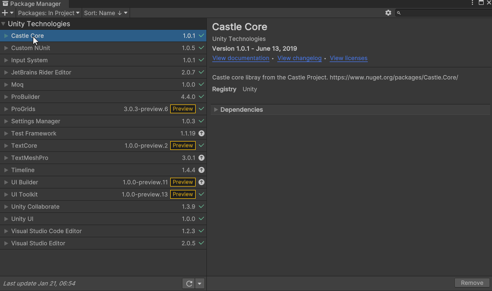

# Getting started

UI Toolkit ([formerly UI Elements](https://forum.unity.com/threads/renaming-uielements-to-ui-toolkit.854245/)) is Unity’s new UI system that can be used as an alternative to IMGUI (editor UI) and UIGUI (runtime UI). It’s still in preview, so some of the screenshots in this tutorial are likely to change as new releases occur.

UI Toolkit completely changes the paradigm on how runtime UI is created. Gone are the days of the Canvas and GameObject based setup. Instead, you develop your UI with patterns similar to web design, including using style sheets. All components that you make can be reusable, making the design pattern a lot quicker. There are two key concepts that are important to building a new UI:

**Unity eXtensible Markup Language Documents (UXML)**: Defines the structure of the user interfaces and reusable UI templates.
**Unity Style Sheets (USS)**: Similar to Cascading Style Sheets (CSS), USS allows you to set visual styles and behaviors to your UI. 

> **UXML** and **UI Document** are two terms that are often used interchangeably during this tutorial.

There are many tools and resources that you can use throughout development to better understand how to setup your UI and how to debug issues:

1. **UI Builder**: Visually create and edit your UXML and USS files. Located at **Window** > **UI Toolkit** > **Debugger**.
2. **UI Debugger**: A diagnostic tool that lets you traverse the hierarchy of the UI to get useful information around the underlying structure and styling.  Located at **Window** > **UI Toolkit** > **UI Builder**.
3. **UI Samples**: Library of code samples for various UI controls. Located at **Window** > **UI Toolkit** > **Samples**.

> UI Toolkit was originally designed as an alternative for IMGUI and many of the controls that you get out of the box with UI Builder do not work with the Runtime version. 

## Download the project files
This tutorial relies on scripts and models that are included in the **starter project**. You can download the **starter project** by:

1. Clone and/or download the [GitHub repository](https://github.com/Yecats/GameDevTutorials). 
2. Navigate to the **Create-an-Inventory-UI-with UI-Toolkit\projects\starterProject** folder in Unity. 

You will see **Scenes**, **Scripts** and a **Sprites** folder in **Assets/WUG**. Open the **Demo** scene in **Assets/WUG/Scenes**. 

## Install UI Toolkit for runtime & UI Builder
UI Toolkit is now shipped via the Unity Editor. However, the features that are needed to use UI Toolkit at runtime require the installation of the latest package. Since the package is not discoverable in the editor, you will need to add it by doing the following:

1. Go to **Window** > **Package Manager**.
2. Click on the **+** button and choose **Add Package from git URL**.
3. Enter the following URL: **com.unity.ui**.

You will need to install UI Builder if you are on an editor version earlier than 2021.1:

1. First make sure **Preview Packages** is turned on by going to **Project Settings** > **Package Manager**. Check **Enable Preview Packages** under the **Advanced Settings** section.
2. Back in **Package Manager**, search for **UI Builder** and click **Install**.

> As of the writing of this tutorial, there is a bug when first installing the UI Toolkit package that requires you to restart Unity. You will know that this still applies if you get a series of console errors after installing.

### [Previous (Introduction)](../readme.md)    |     [Next (Design the Inventory UI)](./pt2.md)

