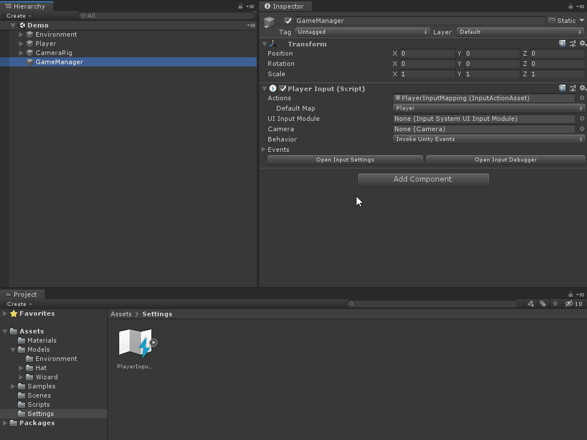

# Refactoring and setting up the project

> ##### This is a continuation of the [How to make a configurable camera with the new Input System](./How-to-make-a-configurable-camera-with-the-new-Input-System) tutorial, which covers fundamental knowledge of the Input System. If you have skipped the tutorial but want to follow along, make sure to grab the starterProject files in this repository.

In the first tutorial, [How to make a configurable camera with the new Input System](./How-to-make-a-configurable-camera-with-the-new-Input-System), we hooked up interacting with the Input System events via the Player Input component. Since we are going to listen for events via C#, we no longer need that component:

1. Go to the **GameManager** game object and delete the **Player Input** component.

We can take advantage of the Input System's ability to automatically generate C# class based off of our Input Action asset file that we created. This will let us more easily interact with our definition file. To generate the file:

1. Click on the **PlayerInputMapping** asset. 
2. Check the box labeled **Generate C# Class**. 
3. The properties should be:
   1. **C# Class File**: Assets/Settings/PlayerInputMapping.cs
   2. **C# Class Name**: PlayerInputMapping
   3. **C# Class Namespace**: <Global Namespace>
4. Click **apply**.

This will create a new file at the specified location (Assets/Settings) with the class name of PlayerInputMapping under the global namespace. 

### [Previous (Introduction)](../readme.md)    |     [Next (Listening for Callback Events)](./pt-2-listening-for-callback-events.md)
